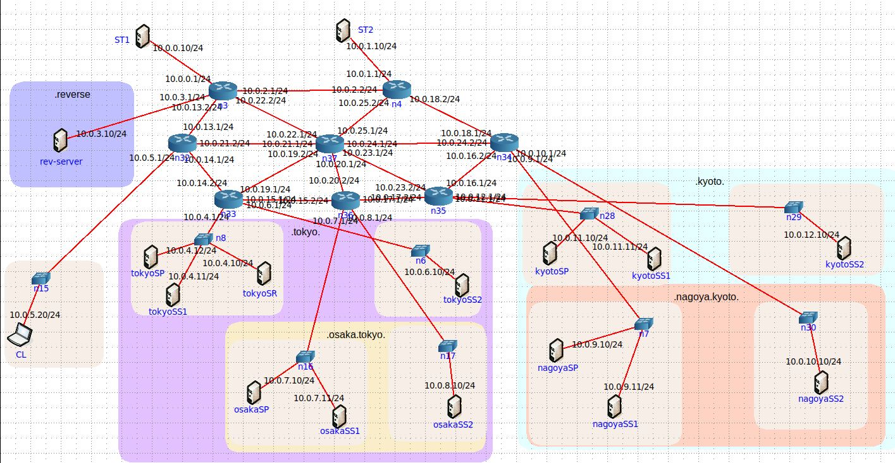

# Implementação de um Sistema DNS 

Tendo em consideração as normas que especificam o sistema DNS da Internet, podemos identificar 
quatro tipos de elementos fundamentais que podem interagir: Servidor Primário (SP), Servidor 
Secundário (SS), Servidor de Resolução (SR) e Cliente (CL).

<b>SP</b> – Servidor DNS que responde a, e efetua, queries DNS e que tem acesso direto à base de 
dados dum domínio DNS, sendo a autoridade que o gere. Qualquer atualização necessária à 
informação dum domínio DNS tem de ser feita diretamente na base de dados do SP. Para além 
dos dados respeitantes diretamente ao domínio DNS, um SP tem de ter acesso a informação de 
configuração específica (domínios para os quais é SP, portas de atendimento, identificação dos 
ficheiros das bases de dados, identificação do ficheiro de log, informação de segurança para 
acesso às bases de dados, identificação dos SS respetivos e dos SP dos subdomínios, endereços 
dos servidores de topo, etc.). Neste projeto, um SP tem como input um ficheiro de configuração, 
um ficheiro de base de dados por cada domínio gerido e um ficheiro com a lista de servidores de 
topo; como output tem um ficheiro de log.

<b>SS</b> – Servidor DNS que responde a, e efetua, queries DNS além de ter autorização e autoridade 
para possuir (e tentar manter atualizada) uma réplica da base de dados original do SP autoritativo 
dum domínio DNS. Um SS tem de ter acesso a informação de configuração específica (domínios 
para os quais é SS, portas de atendimento, identificação dos SP dos domínios para os quais é SS, 
identificação do ficheiro de log, informação de segurança para acesso aos SP, endereços dos 
servidores de topo, etc.). Neste projeto, um SS tem como input um ficheiro de configuração e 
um ficheiro com a lista de servidores de topo; como output tem um ficheiro de log. Além disso, 
por razões de segurança, foi decidido que a informação replicada do SP é armazenada apenas em 
memória volátil no SS.

<b>SR</b> – Servidor DNS que responde a, e efetua, queries DNS sobre qualquer domínio, mas que não 
tem autoridade sobre nenhum pois serve apenas de intermediário. Um SR também é conhecido 
como local DNS server, DNS resolver, DNS cache-only server, DNS forwarder, etc. Um SR pode 
ser implementado a muitos níveis da rede, desde um processo em cada aplicação cliente, até um 
servidor DNS que responde aos clientes duma rede IP local, aos clientes dos provedores de 
serviços ou aos clientes duma instituição. É comum, hoje em dia, os próprios sistemas operativos 
incluírem um SR que pode ser contactado diretamente pelos programadores através de API 
específicas. Os SR podem funcionar em cascata, dependendo da gestão da configuração dos 
clientes, dos provedores de serviços e das instituições. Um SR tem de ter acesso a informação de 
configuração específica (eventuais domínios por defeito e lista dos servidores DNS que deve 
contactar, porta de atendimento, identificação do ficheiro de log, endereços dos servidores de 
topo, etc.). Neste projeto, um SR tem como input um ficheiro de configuração e um ficheiro com 
a lista de servidores de topo; como output tem um ficheiro de log. 

<b>CL</b> – Uma aplicação cliente de DNS é o processo que precisa da informação da base de dados 
de DNS dum determinado domínio (por exemplo, uma aplicação de browser, um cliente de e-mail, um cliente de ftp, etc.). Obtém essa informação realizando queries DNS a um SR (duma 
lista de SR predefinida). Normalmente, um CL tem uma lista de SR num ficheiro de configuração 
(endereços IP e portas de atendimento) ou usa o SR do próprio sistema operativo. Neste projeto 
será desenvolvido um CL específico para se consultar o DNS diretamente (à imagem do nslookup 
e outras aplicações semelhantes). O input e output deste CL será através da linha de comando 
sem necessidade dum ficheiro de configuração.

Para além destes tipos fundamentais de elementos, existem duas variantes especiais de servidores: os 
<b>Servidores de Topo (ST, ou DNS root servers)</b> e os <b>Servidores de Domínios de Topo (SDT, ou DNS 
Top-Level Domain servers)</b>. Para o contexto deste projeto, o comportamento dos SDT é igual aos SP ou 
aos SS (ou seja, um SP ou SS autoritativos para um domínio de topo é um SDT) ainda que não tenham 
domínios hierarquicamente acima na árvore DNS. Por outro lado, os ST são como SP, mas têm apenas 
uma base de dados em que, para cada domínio de topo, inclui informação dos SDT respetivos (i.e. os 
nomes e os endereços IP dos seus SS e do seu SP). Portanto, só podem responder com estes dois tipos 
de informação. No contexto deste projeto, tanto os ST como os SDT devem ser implementados com o 
mesmo componente que implementa um SP ou um SS.

## Topologia 

